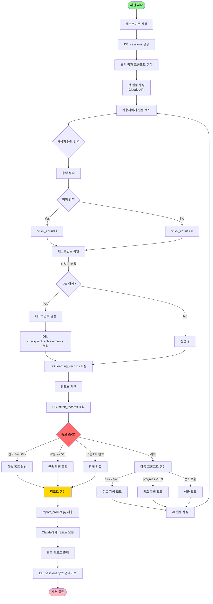

# Socrates-AI 
fastAPI로 서빙하는 코드입니다.

1. 아래 플로우는 수정 가능한 플로우입니다.
2. 프롬프트 사항은 prompts안에 markdown으로 있습니다.
3. 2025-12-17 18:00 기준으로 langgraph 에러 발생하고 있어 수정해야 합니다.
4. 테스트

----
### 2025-12-18
- utils 문제 해결(gitignore에 추가되서 문제였음)

### 2025-12-17

- 채팅 세션 플로우

